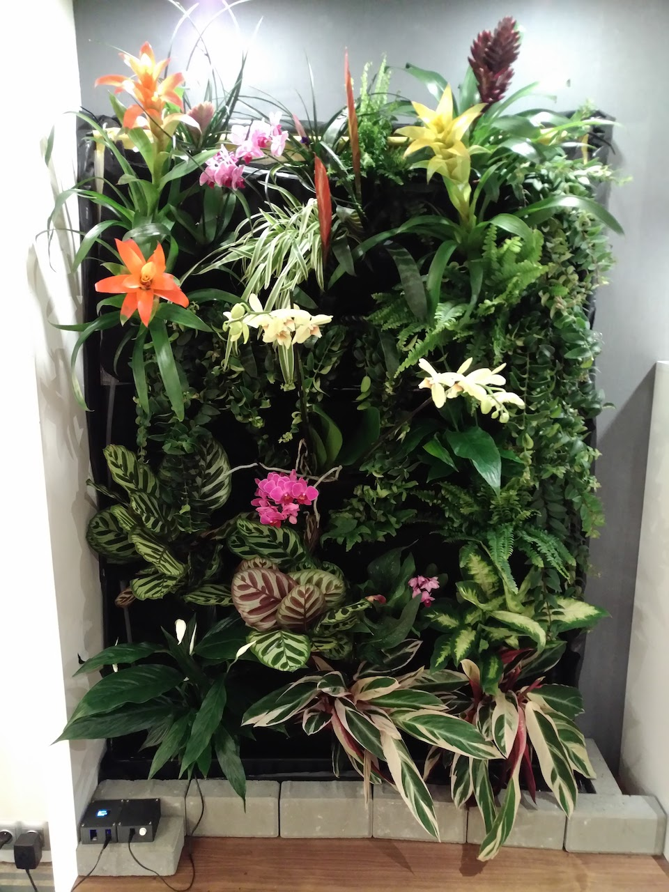

# Watering Machine

Modular Watering Machine (Arduino compatible) which allows you to water your crops/plants when needed and provide grow lights on specified interval.

## Introduction

This repository contains a working library

Allows you to:

- monitor soil moisture with multiple moisture sensors
- water the plants on specified intervals
- water plants when soil moisture gets below certain treshold
- turn on grow lights on specified intervals and with specified duration
- configure and adjust moisture/watering/lighting duration/tresholds

Library aims to be platform agnostic (can be run on Arduino compatible devices: Arduino, ESP32, ESP8266, etc)

Interface with physical layer is separated from Watering Machine "business" logic.
Functions responsible for interfacing with physical infrastructure are injected into components upon their creation.

### State diagram

//TODO

## Usage guide

### Configuration

Watering Machine behaviour can be cotnroller with the WateringMachineConfig object.
All times are in milliseconds.

Example Arduino code:

```cpp
WateringMachineConfig config;
setup(){
    const unsigned long ONE_HOUR = 1000 * 60 * 60; // hour constant

    config.LIGHTING_DURATION = ONE_HOUR * 8; // How long lighting session should last
    config.LIGHTING_INTERVAL = ONE_HOUR * 16; // Interval between lighting sessions
    config.WATERING_MAX_DURATION = ONE_HOUR /2; // How long watering should last
    config.WATERING_MAX_INTERVAL = ONE_HOUR * 24 * 7; // Maximal interval between waterings. After that time, watering will start even if avarage moisture level from sensors is over the MOISTURE_TRESHOLD
    config.WATERING_MIN_INTERVAL = ONE_HOUR; // Minimal interval between waterings. After watering is done it won't start again, before WATERING_MIN_INTERVAL has passed,even if avarage moisture level from sensors is below the MOISTURE_TRESHOLD
    config.MOISTURE_TRESHOLD = 52; //if avarage moisture level from sensors is below the MOISTURE_TRESHOLD watering starts
    config.WATERING_STOP_TRESHOLD = 80; //watering will stop if avarage moisture level from sensors reaches that value
}
```

### Sensors adjustment

//TODO

### Arduino

#### Test/Evaluate/Understand the code

1. Clone or download this repository
2. Uncomment the line // #define WATERING_TEST 1 in watering-machine.ino
3. Open watering-machine.ino inArduino IDE
4. Connect Arduino compatible device to USB port
5. Set port to correct value
6. Click Upload
7. After upload has finished open Serial Terminal and set baud rate to 115200
8. You can see now logs printed by Watering Machine
9. You can experiment with different values returned by Control function, reupload the code and see how this influences the behaviour

#### Run on your own device and setup

1. Build/prototype your Watering Machine (see example Schematic and Bill of Materials)
2. Clone or download this repository
3. Rename root folder e.g. my_watering_machine
4. Duplicate /watering-machine.ino and rename it to mywaterin_machine.ino
5. Copy /src/Firmware/Arduino/ControlFunctions.v[x].h to /libraries/Arduino/ControlFunctions.v[x].h folder
6. change include path of ControlFunctions.v[x].h to the new one
7. Adjust pin numbers in ControlFunctions file to match your build

## Use Cases



## Project structure

.
├── docs - documentation and other file assets (images, uml etc)
├── libraries - Here you can place some aditional libraries if needed
├── src - Waterng Machine code
│   ├── Firmware - Control Functions which allow to communicate with a hardware/physical components. Those are injected to component objects upon their creation.
│   │   ├── Arduino - Arduino compatible examples of Control functions
│   │   └── ControlFunctions.Test.h - Test Control Functions to experiment with
│   └── WateringMachine/
│       ├── Components/ - concerte classes of the components (sensors, pump, lights etc.)
│       │   └── StateMachineInterfaces/ - Abstract Component state MAchine classes to be derived by concerte component classes.
│       ├── States/ - Watering MAchine State classes (Watering, Idle, Lighting)
│       ├── Utils/ - Utility classes (logs, formatting, etc. )
│       ├── WateringMachine.cpp
│       ├── WateringMachine.h - main control class of the Watering Machine
│       └── WateringMachineConfig.h 
└── watering-machine.ino - example Arduino sketch with fulll configuration

## Improvements and changes

## Questions

For questions about the usage of the libraries, please fill in an issue labeled "question" in Github as that makes it far easier to track them.

## Bugs and issues

For bugs in the libraries, please fill in an issue in Github as that makes it far easier to track them. If possible provide a minimal code snippet that exposes the bug. Also proposals for solutions are welcome.
Issues are not bugs but still possible problematic. E.g. if a library is too slow for your application that is an issue, not a bug. Please fill in an issue and provide as much details about your requirements.

## License and Warranty

Apache License
Version 2.0, January 2004
[http://www.apache.org/licenses/](http://www.apache.org/licenses/)

Please check the file LICENSE and NOTICE for the details.
Give credits a it's requried by the license and if you want to donate, please donate to charity like "doctors without borders".
